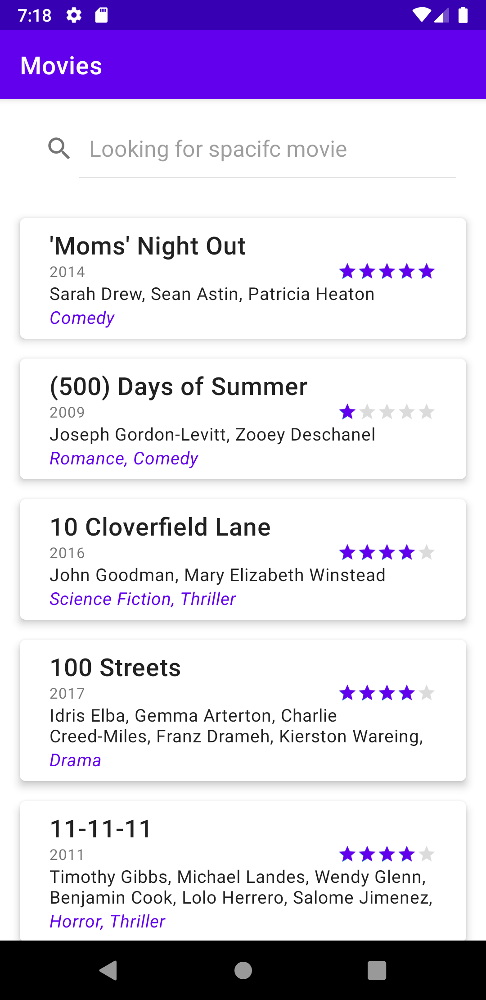
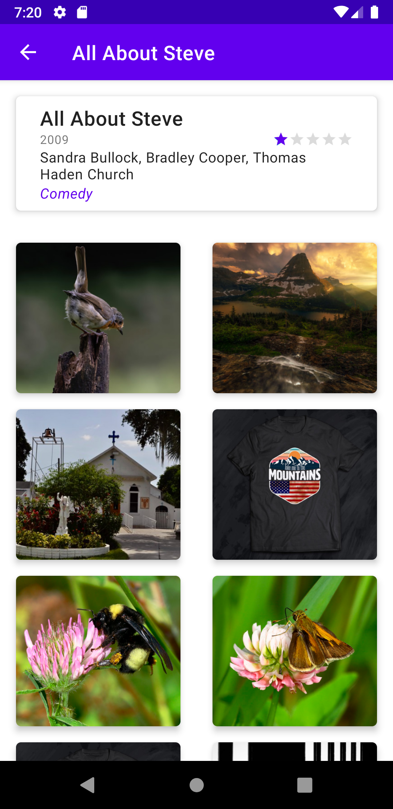

Android Movie App (SWVL Mobile Challenge)
=========================================
Android Application to Show list of movies and their details 

Getting Started
---------------
To build this project, use the `gradlew build` command or use "Import Project" in Android Studio v4.0+.

There are two Gradle tasks for testing the project:
* `connectedAndroidTest` - for running Espresso on a connected device
* `test` - for running unit tests

### inMemoryRepo OR LocalMovieRepo

I have made 2 approach of searching for Movie one of them is based on Database Queries [LocalMovieRepo] and another on is based on memory search [inMemoryRepo ]
I will provide more details later on the benchmark of the 2 solutions 

to use inMemoryRepo just add this line to the `gradle.properties` file, either in your user home
directory (usually `~/.gradle/gradle.properties` on Linux and Mac) or in the project's root folder:

```
is_in_memory_repo=true
```

### Flickr API key

Movies App uses the [FLICKER API](https://www.flickr.com/services/api/flickr.photos.search.html) to load pictures Movie details Screen . To use the API, you will need to obtain a developer Access key. See the
[Flicker API Documentation](https://www.flickr.com/services/api/misc.api_keys.html) for instructions.

Once you have the key, add this line to the `gradle.properties` file, either in your user home
directory (usually `~/.gradle/gradle.properties` on Linux and Mac) or in the project's root folder:

```
flicker_access_key=<your flickr access key> 

```

The app is still usable without an API key, though you won't be able to navigate to see the Flicker pics in movie details 

Screenshots
-----------





Project Architecture
--------------------
the project's folders are organized in feature grouped for business feature and MVVM for the project code.
for shared db / utils / workers you will find them in shared folder which will be used across the application 


Android Studio IDE setup
------------------------
Movies uses [ktlint](https://ktlint.github.io/) to enforce Kotlin coding styles.

- Close Android Studio if it's open

- Download ktlint using these [installation instructions](https://github.com/pinterest/ktlint/blob/master/README.md#installation)

- Apply ktlint settings to Android Studio using these [instructions](https://github.com/pinterest/ktlint/blob/master/README.md#-with-intellij-idea)

- Start Android Studio
